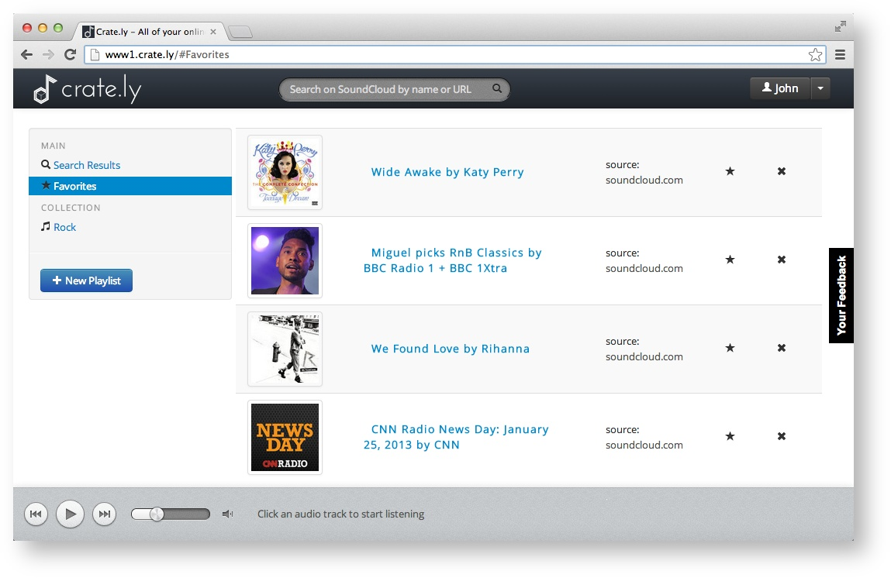

# crate.ly

Crate.ly - All the online music in one place (discontinued)

See the [static brach](https://github.com/gianpaj/crately/tree/static) for the static  or landing page which you can see on [crate.ly](http://crate.ly) 

## Project's Objective

The idea came about while doing an internship in my 3rd year in DIT. When you find a great track on your work computer either on SoundCloud, YouTube or else, there really no good way to organise those tracks so you can later download them, find more from the artist or DJ.

So the initial goal was to be able to quickly mark songs to "Listen To It Later". Following the domain not being available I thought the act of putting records in a "crate" could mean archiving songs for later.

To quickly mark songs, the first implementation was to done via a browser Bookmarklet.

## Technologies

### Front-end:

- [Knockout.js](knockoutjs.com) 2.2 for the JavaScript Framework
- jQuery, jQuery UI
- Bootstrap 2
- [Grunt](http://gruntjs.com) (which requires npm, [node](https://
github.com/joyent/node/wiki/Installing-Node.js-via-package-manager))
- LiveReload Chrome [Extension](https://chrome.google.com/webstore/detail/livereload/jnihajbhpnppcggbcgedagnkighmdlei)

For the actual music web app:

- [SoundManager](http://www.schillmania.com/projects/soundmanager2/)
- [Sammy.js](http://sammyjs.org/) for routes
- [jquery.noty](http://needim.github.io/noty/)
- [knockout-sortable](https://github.com/rniemeyer/knockout-sortable)
- [spin.js](http://fgnass.github.io/spin.js/)

### Back-end:

- [NGINX](https://www.digitalocean.com/community/articles/how-to-install-nginx-on-ubuntu-12-04-lts-precise-pangolin) for the static page and assets (css, js, fonts, etc)
- Python [Flask](http://flask.pocoo.org/) Web Framework for the REST API and Auth
- [Cherrypy](http://www.cherrypy.org/) WSGI Framework for production
- [Mongoengine](http://mongoengine.org/) (ORM for MongoDB)
- [MongoDB](https://www.mongodb.org/)
- [Fabric](http://fabfile.org/) for simple continuous deployment

### Hosting:

I used:

- Virtual Server: Digital Ocean 512MB droplet - Ubuntu 12.04 LTE
- DNS: Cloudflare

## Quick start

### Configuration

- Save the SoundCloud API KEY in [script.js](/listentoitlater/static/js/script.js)

### Start

Run these commands to start the **development** environment:

	mongod
	grunt

Open an new terminal:

	scripts/startcrately.sh

Open in the browser [http://0.0.0.0:8000/](http://0.0.0.0:8000)

## Setup the production server

Yes, i did so many time I wrote all the steps :)

These are for the Ubuntu 12.04 LTE.

Ssh into your server and add a linux user:

	adduser crately sudo
	visudo

Make all the users not required:

	%sudo   ALL=(ALL) NOPASSWD: ALL

Allow the user ssh access so you can use that rather than root:

	nano /etc/ssh/sshd_config

Edit/Add this line:

	AllowUsers crately

Transfer your public key to from your dev computer:

	scp .ssh/id_rsa.pub crately@IPADDR:.ssh/authorized_keys
	
Go back to the server and change the permission of the ssh authorized_keys:

	chmod 600 ~/.ssh/authorized_keys

Make fabric work without password by authorizing your own server key:

	ssh-keygen -t dsa -P '' -f ~/.ssh/id_dsa
	cat ~/.ssh/id_dsa.pub >> ~/.ssh/authorized_keys
	
Install zsh (optional):

	curl -L https://github.com/robbyrussell/oh-my-zsh/raw/master/tools/install.sh | sh
	chsh -s /bin/zsh

Install MongoDB (or follow [this](http://docs.mongodb.org/manual/administration/install-on-linux/)):

	sudo apt-key adv --keyserver keyserver.ubuntu.com --recv 7F0CEB10
	echo 'deb http://downloads-distro.mongodb.org/repo/ubuntu-upstart dist 10gen' | sudo tee /etc/apt/sources.list.d/mongodb.list
	sudo apt-get update
	sudo apt-get install mongodb-10gen

Install [git](http://git-scm.com/), python and [pip](http://www.pip-installer.org/):

	sudo apt-get install build-essential python-dev python-pip git

Install [virtualenv](http://www.virtualenv.org/) and Fabric:

	sudo pip install virtualenv fabric

Setup the directory for the project and deploy from a remote git:

	mkdir crately
	mkdir crately.git
	cd crately.git
	git init --bare
	git config core.bare false
	git config receive.denycurrentbranch ignore
	git config core.worktree ../crately

Setup a post-receive hook to update the worktree folder after new changes have been pushed to the repo:

	nano hooks/post-receive
	
Add this:

	#!/bin/sh
	cd ~/crately/scripts
	fab deploy

(see the [fabric](/scripts/fabfile.py) script)

Get the Python web server ready:

	cd ~
	virtualenv crately/env
	
	sudo cp ~/crately/scripts/cherrypy-ubuntu /etc/init.d/cherrypy
	sudo chmod +x /etc/init.d/cherrypy

(see the [cherrypy-ubuntu](/scripts/cherrypy-ubuntu) init.d script)
	
Add the server's git repo back in the dev computer:

	git remote add digitalocean crately@direct.crate.ly:crately.git

Push the repo to the server:

	git push digitalocean master

Start the web server!

	sudo service cherrypy start
	
Replace your domain in the NGINX config file:

- [nginx_config](/scripts/nginx_config)

Add 301 redirect from port 80 to https:// (403):

	sudo apt-get install nginx
	sudo cp scripts/nginx_config /etc/nginx/sites-available/default
	
	sudo service nginx start

## Useful commands

Take a full backup of the files in the current directory (.)

	tar -zcvf /tmp/ubuntu-12.04.1-bkp.tar.gz .
	
Date a full backup of MongoDB. Note this can take substantial load:

	mongodump -o /tmp